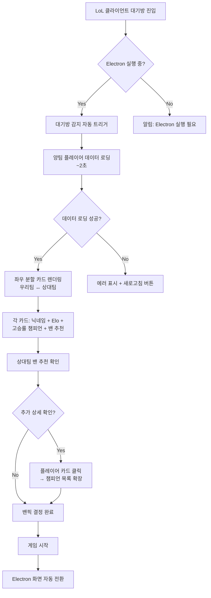
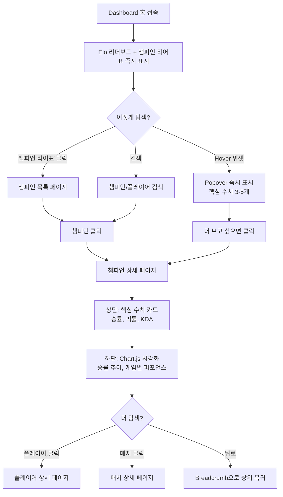
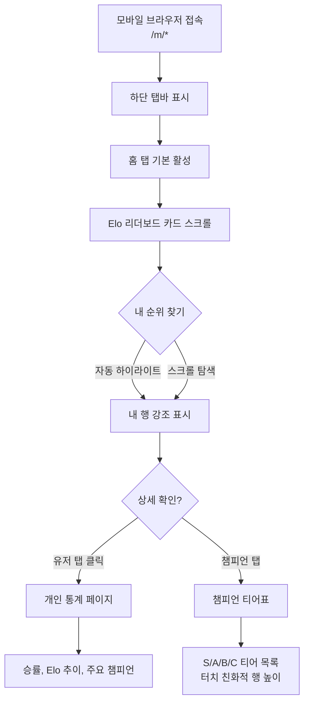

# UX Design Specification lol-event

**Author:** 박기준
**Date:** 2026-03-21

---

<!-- UX design content will be appended sequentially through collaborative workflow steps -->

## Executive Summary

### Project Vision

lol-event는 고정 멤버들의 내전을 위한 전용 플랫폼으로, 기존 데이터 모델을 유지하면서 Dashboard(웹), Electron 대기방, 모바일 웹 세 영역의 UI/UX를 전면 재설계한다. 탐색성·가독성·모바일 경험 개선이 핵심 목표.

### Target Users

- **일반 참가자 (50-60명):** PC/모바일 혼용. 통계 확인, Elo 리더보드, 대기방 밴픽 참고가 주요 사용 패턴.
- **관리자 (1명):** 멤버 데이터 기반 팀 구성, 리그 운영 및 데이터 관리.

### Key Design Challenges

1. **계층 탐색 구조** — 전체→챔피언→플레이어→매치 드릴다운을 클릭 수 최소화로 구현
2. **데이터 가독성** — 복잡한 통계를 숫자 우선으로 한눈에 파악 가능하게
3. **플랫폼 분리** — 모바일/데스크톱을 각각 최적화, Electron은 별도 UX
4. **Electron 정보 밀도** — 대기방 제한 시간 내 즉시 스캔 가능한 레이아웃

### Design Opportunities

1. **내전 전용 메타** — 우리 리그 데이터 기반 챔피언 티어표로 차별화된 가치 제공
2. **Zero-friction 자동화** — 대기방 진입 시 Electron 자동 트리거로 마찰 제거
3. **수치 중심 시각화** — 이모지 없이 정확한 숫자로 신뢰감 있는 데이터 표현

---

## Core User Experience

### Defining Experience

lol-event의 핵심 경험은 "필요한 데이터를 최소 동작으로 얻는 것"이다. 유저명/챔피언명 hover로 통계를 즉시 확인하는 패턴이 이 철학을 대표한다. 대기방에서 상대를 파악하고 밴픽을 결정하는 것이 가장 중요한 사용 순간.

### Platform Strategy

- **Dashboard(웹/데스크톱):** 마우스 기반 인터랙션 중심. hover 통계 위젯 활용.
- **Dashboard(모바일):** 데스크톱과 분리된 전용 구현. touch 최적화.
- **Electron:** 윈도우 데스크톱 전용. 대기방 자동 트리거 기반.

### Effortless Interactions

- **Hover 통계 위젯 (PlayerLink/ChampionLink):** 유저명·챔피언명 위에 마우스만 올려도 핵심 통계 즉시 표시. 페이지 이동 없음. — 기존 구현 유지 필수.
- **Electron 자동 트리거:** 대기방 진입 감지 시 분석 화면 자동 표시. 별도 조작 불필요.
- **계층 드릴다운:** 전체→챔피언→플레이어→매치를 클릭 한 번으로 자연스럽게 이동.

### Critical Success Moments

- 대기방에서 상대 위협 챔피언을 10초 안에 파악
- 유저/챔피언 hover로 페이지 이탈 없이 통계 확인
- 모바일에서 리더보드·개인 통계를 스크롤 없이 핵심 파악
- 관리자가 한 화면에서 멤버 전체 Elo 비교 후 팀 구성

### Experience Principles

1. **Zero-navigation for quick info** — hover/자동 트리거로 페이지 이동 최소화
2. **숫자가 답이다** — 이모지·그래픽보다 정확한 수치로 신뢰 제공
3. **컨텍스트 유지** — 지금 보고 있는 화면을 벗어나지 않고 추가 정보 접근
4. **플랫폼별 최적화** — 모바일·데스크톱·Electron 각각 최적 경험 설계

---

## Desired Emotional Response

### Primary Emotional Goals

- **자신감** — 대기방에서 상대 데이터 확인 후 "나는 준비됐다"는 느낌
- **명료함** — 복잡한 통계를 보는 즉시 핵심을 파악하는 "한눈에 들어온다"
- **소속감** — 우리 리그의 기록이 쌓이는 "여기가 우리 내전의 역사"

### Emotional Journey Mapping

- **대기방 진입 시:** 자동 트리거 → 즉각적인 정보 제공 → 자신감
- **통계 탐색 시:** 계층 구조 탐색 → 빠른 파악 → 명료함
- **리더보드 확인 시:** 내 순위와 맥락 → 경쟁심 + 소속감
- **오류/로딩 시:** 최소한의 불안, 빠른 회복

### Micro-Emotions

- **신뢰** — 숫자 기반 정확한 데이터로 "이 정보 맞겠지"
- **효능감** — hover 위젯으로 페이지 이동 없이 해결 → "내가 빠르다"
- **회피할 감정:** 탐색 좌절, 인지 과부하, 플랫폼 좌절

### Design Implications

- 자신감 → Electron 카드에 위협 챔피언 + 밴 추천을 명확히 표시
- 명료함 → 숫자 우선, 핵심 지표만 노출, 정보 계층 명확화
- 소속감 → 내전 자체 티어표, 멤버 리더보드 홈 노출
- 신뢰 → 이모지 없이 정확한 수치 중심 표현

### Emotional Design Principles

1. **정보는 즉각적으로** — 기다림과 탐색이 감정을 해친다
2. **적을수록 명료하다** — 보여주는 것을 줄여야 핵심이 보인다
3. **숫자는 신뢰다** — 수치가 꾸밈보다 강하다
4. **우리 데이터는 특별하다** — 외부 서비스에 없는 내전 맥락을 강조

---

## UX Pattern Analysis & Inspiration

### Inspiring Products Analysis

**OP.GG**
- 챔피언을 티어(S/A/B/C)로 분류하는 직관적 구조
- 승률/픽률/밴률을 테이블로 명확하게 표현
- 챔피언 스플래시 아트 + 수치 조합으로 스캔 용이
- 적용 포인트: 내전 자체 티어표, 챔피언 통계 페이지

**LoL 클라이언트 대기방**
- 좌우 팀 분리 레이아웃이 유저에게 이미 친숙
- 각 플레이어 슬롯 구조
- 적용 포인트: Electron 대기방 카드 레이아웃

### Transferable UX Patterns

**네비게이션:**
- 계층 드릴다운 (전체→챔피언→플레이어→매치) — OP.GG 스타일
- 사이드바 고정 네비게이션 — 현재 위치 항상 인지 가능

**인터랙션:**
- Hover 통계 팝업 — 컨텍스트 이탈 없이 빠른 정보 접근 (기존 유지)
- 테이블 행 클릭으로 드릴다운 — 자연스러운 탐색 흐름

**시각:**
- 단색/라인 아이콘 사용 — 복잡한 이모지 사용 금지
- 수치 중심 레이아웃 — 그래픽 장식 최소화
- 챔피언 스플래시 아트 + 텍스트 수치 조합

### Anti-Patterns to Avoid

- 복잡한 컬러 이모지 사용 → 시각적 노이즈
- 과도한 그래프/차트 → 숫자가 더 직관적
- 여러 단계 클릭을 요구하는 탐색 → 정보 접근 마찰
- 모달/팝업 남발 → 컨텍스트 방해

### Design Inspiration Strategy

**그대로 채택:**
- OP.GG 티어표 레이아웃 구조
- LoL 클라이언트 좌우 팀 분리 패턴
- 단색/라인 아이콘 시스템

**변형 적용:**
- OP.GG 티어표 → 우리 리그 데이터 기반으로 재계산
- 클라이언트 대기방 → 플레이어 카드에 통계 데이터 추가

**배제:**
- 복잡한 이모지, 컬러 이모지
- 데이터를 숨기는 과도한 시각화

---

## Design System Foundation

### Design System Choice

**Tailwind CSS + shadcn/ui**

기존 Tailwind CSS를 유지하면서 shadcn/ui를 컴포넌트 라이브러리로 채택.

### Rationale for Selection

- 기존 Tailwind 코드베이스와 완전 호환 — 마이그레이션 비용 없음
- headless 아키텍처로 OP.GG 스타일 티어표, 데이터 테이블 자유롭게 구현
- 단색/라인 아이콘은 Lucide React (shadcn/ui 기본 포함)로 통일
- 다크 테마 기본 지원 — 게임 앱 분위기에 적합
- 1인 개발 환경에서 빠른 개발 속도 확보

### Implementation Approach

- shadcn/ui CLI로 필요한 컴포넌트만 선택적 추가
- 기존 컴포넌트(Button, Input, Modal 등) shadcn/ui로 점진적 교체
- PlayerLink/ChampionLink hover 위젯은 Popover 컴포넌트 활용
- 아이콘: Lucide React 단일 라이브러리로 통일

### Customization Strategy

- 다크 테마 기본으로 설정 (게임 앱 정체성)
- 색상 토큰: 내전 브랜드 컬러 정의 (추후 협의)
- 타이포그래피: 수치 표현에 최적화된 폰트 계열
- 복잡한 이모지 금지, Lucide 아이콘으로 대체

---

## 2. Core User Experience

### 2.1 Defining Experience

**Dashboard(웹):**
"챔피언/플레이어 이름에 hover하면 핵심 통계가 즉시 표시된다.
상세 페이지로 들어가면 Chart.js 기반 시각화로 깊이 있는 분석을 제공한다."

- 목록/전체 화면 → 숫자 중심 빠른 스캔
- 상세 화면(챔피언/플레이어 디테일) → Chart.js 차트로 심층 분석

**Electron:**
"대기방에 입장하면 자동으로 양팀 분석 화면이 펼쳐진다.
개인 통계 기반 위협 챔피언과 밴 추천이 즉시 표시된다."

### 2.2 User Mental Model

- **목록 화면:** "빠르게 훑고 싶다" → 수치 중심 테이블/카드
- **상세 화면:** "이 챔피언/유저를 깊이 알고 싶다" → 차트로 트렌드/패턴 파악
- **대기방:** "준비할 시간이 없다" → 자동 트리거, 즉각 표시

### 2.3 Success Criteria

- Hover 위젯: 마우스 올린 후 300ms 이내 통계 표시
- 상세 페이지: Chart.js로 승률 추이, 게임별 퍼포먼스 시각화
- Electron: 대기방 진입 2초 이내 양팀 카드 렌더링
- 전체 → 상세 드릴다운: 클릭 1회로 이동

### 2.4 Novel vs. Established Patterns

**기존 패턴 활용 (학습 비용 없음):**
- Hover 팝오버 — 이미 PlayerLink/ChampionLink로 구현됨, 유지
- OP.GG 스타일 티어표 — 유저에게 친숙한 패턴
- LoL 클라이언트 좌우 분할 — Electron 대기방에 적용

**혁신 포인트:**
- 내전 전용 데이터 기반 Chart.js 차트 — 외부 서비스에 없는 우리만의 분석
- Electron 자동 트리거 — 기존 앱은 수동 조작 필요

### 2.5 Experience Mechanics

**Dashboard Hover 위젯 플로우:**
1. 유저명/챔피언명에 마우스 진입 (Initiation)
2. Popover 즉시 표시 — 핵심 수치 3-5개 (Interaction)
3. 수치 강조 표시로 중요 정보 부각 (Feedback)
4. 마우스 이탈 시 자연스럽게 닫힘 (Completion)

**상세 페이지 Chart.js 플로우:**
1. 목록에서 챔피언/플레이어 클릭 (Initiation)
2. 상단: 핵심 수치 카드 / 하단: Chart.js 차트 (Interaction)
3. 차트 hover 시 데이터 포인트 툴팁 표시 (Feedback)
4. 계층 탐색 breadcrumb으로 복귀 (Completion)

---

## Visual Design Foundation

### Color System

**테마:** 다크 네이비 + 청록색 강조 (Dark Navy + Teal Accent)

**기본 팔레트 (Tailwind CSS 토큰):**

| 역할 | 색상 | Hex |
|------|------|-----|
| Background (최심층) | Deep Navy | #0A0E1A |
| Surface (카드/패널) | Navy | #0F1629 |
| Surface Elevated | Light Navy | #161D35 |
| Border | Navy Border | #1E2A4A |
| Primary Accent | Teal | #00B4D8 |
| Primary Hover | Teal Light | #48CAE4 |
| Text Primary | White | #F0F4FF |
| Text Secondary | Blue Gray | #8899BB |
| Text Muted | Dim | #4A5568 |
| Success (승리) | Green | #10B981 |
| Danger (패배) | Red | #EF4444 |
| Warning | Amber | #F59E0B |

**시맨틱 컬러:**
- 승률 높음 → Teal/Green
- 승률 낮음 → Red
- 밴 추천 강조 → Amber
- 티어 S → Gold (#FFD700)
- 티어 A → Teal, B → Blue Gray, C → Muted

### Typography System

- **Primary Font:** Inter (수치·UI 가독성 최적)
- **Mono Font:** JetBrains Mono (수치 정렬, KDA/승률 등)
- **Type Scale:** 12/14/16/20/24/32px
- **수치 표현:** 항상 Mono 폰트로 정렬감 확보

### Spacing & Layout Foundation

- **Base Unit:** 4px (Tailwind 기본)
- **레이아웃 밀도:** 컴팩트 — 데이터 앱 특성상 정보 밀도 우선
- **사이드바:** 고정 240px (데스크톱), 하단 탭바 (모바일)
- **카드 패딩:** 16px / 테이블 행 높이: 48px
- **그리드:** 12컬럼 (데스크톱), 단일 컬럼 (모바일)

### Accessibility Considerations

- 모든 텍스트/배경 대비 WCAG AA 이상 준수
- Teal 강조색: 배경 대비 4.5:1 이상 확보
- 승/패 색상은 색맹 고려 — 색상 + 텍스트 병행 표시
- 최소 터치 타겟: 44px (모바일)

**Electron 자동 트리거 플로우:**
1. LoL 클라이언트 대기방 진입 감지 (Initiation)
2. 좌우 분할 플레이어 카드 자동 렌더링 (Interaction)
3. 위협 챔피언 + 밴 추천 강조 표시 (Feedback)
4. 게임 시작 시 화면 자동 전환 (Completion)

---

## Design Direction Decision

### Design Directions Explored

4가지 디자인 방향을 탐색했다:

- **A. Command Center:** 좌측 고정 사이드바 네비게이션 + 고밀도 데이터 레이아웃. 통계/리포트 허브에 최적화된 구조.
- **B. Clean Analyst:** 상단 탭 네비게이션 + 여유 있는 카드 레이아웃. 단순하고 가벼운 느낌.
- **C. Electron 대기방:** 화면 좌우를 우리팀/상대팀으로 분할한 플레이어 카드 레이아웃. LoL 클라이언트 패턴 차용.
- **D. 모바일 웹:** 하단 탭바 + 세로 스크롤 중심의 모바일 전용 레이아웃.

### Chosen Direction

플랫폼별 방향:

- **Dashboard(웹/데스크톱): A — Command Center**
  - 좌측 고정 사이드바 (240px)로 계층 탐색 구조(전체→챔피언→플레이어→매치) 수용
  - 콘텐츠 영역은 고밀도 데이터 레이아웃 — 숫자 우선 원칙 적용
  - Chart.js 차트는 상세 페이지(챔피언/플레이어 디테일)에 한정 배치

- **Electron 대기방: C — 좌우 분할 카드**
  - 좌측: 우리팀 5명 카드 / 우측: 상대팀 5명 카드
  - 각 카드: 닉네임 + Elo + 고승률 챔피언 + 밴 추천
  - LoL 클라이언트 대기방과 동일한 좌우 구도 — 학습 비용 0

- **모바일 웹: D — 하단 탭바**
  - 데스크톱과 완전 분리된 전용 구현
  - 하단 탭바 + 세로 스크롤 중심
  - 주요 화면(리더보드, 개인 통계, 챔피언 티어표) 모바일 최적화

### Design Rationale

- **Command Center 선택 이유:** lol-event Dashboard는 데이터 허브 성격이 강하므로 사이드바가 상시 노출되어 계층 탐색이 빠름. 데이터 밀도를 높게 유지하면서도 명확한 네비게이션 구조를 제공함.
- **좌우 분할 선택 이유:** 브레인스토밍 단계에서 이미 확정된 방향. LoL 유저에게 친숙한 패턴이며 양팀 비교가 즉각 가능.
- **하단 탭바 선택 이유:** 모바일 표준 패턴으로 학습 비용 없음. 엄지 접근성 최적화.

### Implementation Approach

- **Dashboard:** React + Tailwind CSS + shadcn/ui 컴포넌트. 사이드바는 `Layout` 컴포넌트로 전역 적용. 상세 페이지에만 Chart.js 동적 임포트.
- **Electron:** 기존 Electron 창 레이아웃에 좌우 분할 그리드 적용. Tailwind `grid-cols-2` 기반.
- **모바일:** `/m/*` 라우팅으로 분리된 전용 페이지. 하단 탭바는 고정 위치 컴포넌트.

---

## User Journey Flows

### Journey 1: Electron 대기방 밴픽 결정

**시나리오:** 유저가 LoL 클라이언트에서 대기방에 입장하면 자동으로 분석 화면이 열리고, 밴픽을 결정한다.

### Journey 2: Dashboard 계층 탐색 (챔피언 상세)

**시나리오:** 유저가 특정 챔피언의 내전 통계를 확인하기 위해 홈에서 챔피언 상세 페이지까지 탐색한다.

### Journey 3: 모바일 리더보드 확인

**시나리오:** 유저가 스마트폰으로 전체 Elo 리더보드와 자신의 순위를 확인한다.

### Journey Patterns

**진입 패턴:**
- Dashboard: 모든 페이지에서 사이드바로 즉시 이동 가능
- Electron: 외부 트리거(대기방 감지) → 자동 진입, 수동 조작 불필요
- 모바일: URL 직접 접근 또는 하단 탭바

**탐색 패턴:**
- 드릴다운: 클릭 1회로 상위→하위 이동, Breadcrumb으로 복귀
- Hover 위젯: 클릭 없이 컨텍스트 내 수치 확인 (데스크톱 전용)
- 카드 확장: 모바일에서 탭으로 상세 토글

**피드백 패턴:**
- 로딩: 스켈레톤 UI (레이아웃 흔들림 방지)
- 성공/실패: 승리 `#10B981` / 패배 `#EF4444` 색상 + 텍스트 병행
- 에러: 인라인 에러 메시지 + 재시도 버튼

### Flow Optimization Principles

1. **최소 클릭 원칙:** 홈에서 원하는 데이터까지 최대 2클릭
2. **Hover 우선:** 상세 페이지 이동 전 Popover로 판단 가능
3. **자동 트리거 우선:** Electron은 유저가 앱을 조작할 필요 없음
4. **데이터 먼저:** 로딩 완료 전에도 레이아웃 구조는 즉시 표시 (스켈레톤)
5. **컨텍스트 보존:** 탐색 후 뒤로가기 시 스크롤 위치 및 필터 유지

---

## Component Strategy

### Design System Components

shadcn/ui 기존 컴포넌트 활용:

| 컴포넌트 | 용도 |
|----------|------|
| `Card` | 플레이어/챔피언 카드, 통계 카드 |
| `Table` | 리더보드, 챔피언 목록, 매치 목록 |
| `Badge` | 티어 표시 (S/A/B/C), Elo 변동 |
| `Popover` | Hover 통계 위젯 (PlayerLink/ChampionLink) |
| `Breadcrumb` | 계층 탐색 복귀 |
| `Skeleton` | 로딩 상태 |
| `Tabs` | 모바일 하단 탭바, 상세 페이지 탭 |
| `Tooltip` | 아이콘 설명 |
| `Button` | 재시도, 액션 버튼 |

### Custom Components

#### PlayerCard (Electron 전용)
- **용도:** 대기방 좌우 분할 레이아웃의 개별 플레이어 카드
- **콘텐츠:** 닉네임 + Elo + 고승률 챔피언 TOP 3 + 밴 추천 태그
- **상태:** default / expanded (클릭 시 챔피언 목록 확장) / loading (스켈레톤)
- **접근성:** `role="article"`, 닉네임 aria-label

#### ChampionTierTable (Dashboard)
- **용도:** OP.GG 스타일 내전 챔피언 티어표
- **콘텐츠:** 티어(S/A/B/C) + 챔피언 아이콘 + 승률 + 픽률 + 게임 수
- **상태:** 티어 섹션 접기/펼치기, 정렬 변경
- **구현:** shadcn `Table` 기반 커스텀

#### EloLeaderboard (Dashboard + 모바일)
- **용도:** 전체 유저 Elo 순위표
- **콘텐츠:** 순위 + 닉네임 + Elo + 변동폭 + 최근 N게임
- **상태:** 자신의 행 자동 하이라이트 (`bg-teal-900/20`)
- **변형:** 데스크톱(테이블) / 모바일(카드 리스트)

#### StatHoverWidget (Dashboard 전용)
- **용도:** PlayerLink/ChampionLink hover 시 표시되는 팝오버 통계
- **콘텐츠:** 핵심 수치 3-5개 (승률, Elo, KDA, 주력 챔피언 등)
- **상태:** 로딩 / 데이터 표시 / 에러
- **트리거:** `onMouseEnter` 300ms 지연 후 표시
- **기존 구현 유지 필수 — 인터페이스만 보강**

#### BanRecommendBadge (Electron 전용)
- **용도:** 밴 추천 챔피언 표시 태그
- **콘텐츠:** 챔피언명 + 밴 가치 점수
- **상태:** 강조(높은 위협도 `#EF4444`) / 일반(`#00B4D8`)
- **구현:** shadcn `Badge` 기반 커스텀

#### MobileBottomNav (모바일 전용)
- **용도:** 모바일 하단 고정 탭바
- **탭:** 홈(리더보드) / 챔피언 / 유저 / (관리자: 추가 탭)
- **상태:** 활성 탭 Teal 강조
- **구현:** `fixed bottom-0` + `safe-area-inset-bottom`

### Component Implementation Strategy

- 모든 커스텀 컴포넌트는 Tailwind 토큰 기반 — 디자인 시스템 색상 변수 사용
- shadcn/ui 컴포넌트를 래핑(wrapping)하여 확장, 완전 재작성 지양
- PlayerLink/ChampionLink + StatHoverWidget 인터페이스는 기존 구현 유지
- Chart.js는 챔피언/플레이어 상세 페이지에만 동적 임포트 (`React.lazy`)

### Implementation Roadmap

**Phase 1 — 핵심 (Electron 대기방, Dashboard 홈):**
- `PlayerCard` — Electron 대기방 핵심
- `EloLeaderboard` — Dashboard 홈 핵심
- `ChampionTierTable` — Dashboard 홈 핵심

**Phase 2 — 상세 페이지:**
- `StatHoverWidget` 보강 — 기존 코드 유지 + 스타일 업데이트
- Chart.js 통합 — 챔피언/플레이어 상세

**Phase 3 — 모바일:**
- `MobileBottomNav`
- `EloLeaderboard` 모바일 변형
- `BanRecommendBadge`

---

## UX Consistency Patterns

### Button Hierarchy

- **Primary** — Teal(`#00B4D8`) 배경, 흰 텍스트. 각 화면의 단일 주요 액션.
- **Secondary** — 테두리만 Teal, 투명 배경. 보조 액션.
- **Ghost** — 텍스트만, 배경 없음. 사이드바 네비게이션 링크.
- **Destructive** — `#EF4444`. 삭제/초기화 등 위험 액션.
- **규칙:** 한 화면에 Primary 버튼 최대 1개. 관리자 페이지 외에는 Destructive 지양.

### Feedback Patterns

- **로딩:** Skeleton UI — 레이아웃 구조 유지, 텍스트/수치 영역만 pulse 애니메이션
- **성공:** 승리 `#10B981` 텍스트 + 수치 (색상 + 텍스트 병행)
- **실패/패배:** `#EF4444` 텍스트 + 수치
- **에러:** 인라인 에러 메시지 (`text-red-400`) + 재시도 버튼. 토스트 알림 최소화.
- **빈 상태:** "데이터가 없습니다" 텍스트 + 이유 한 줄. 이모지 없음.

### Navigation Patterns

- **Dashboard(데스크톱):** 좌측 고정 사이드바 240px. 활성 항목 Teal 좌측 보더 + 배경 강조.
- **모바일:** 하단 탭바 4-5개 탭. 활성 탭 Teal 아이콘 + 텍스트. `safe-area-inset-bottom` 적용.
- **계층 탐색:** Breadcrumb 상단 고정. `전체 > 챔피언 > 야스오` 형태. 각 항목 클릭 가능.
- **Electron:** 단일 화면 (대기방 뷰). 탭/메뉴 없음 — 대기방 전용 UX.

### Data Display Patterns

- **테이블:** 행 높이 48px, hover 시 `bg-slate-800/50` 강조. 정렬 가능 컬럼은 헤더에 화살표 아이콘.
- **숫자 강조:** 중요 수치는 `font-mono` (JetBrains Mono) + 큰 폰트 사이즈. 소수점 2자리 통일.
- **승률 표시:** `53.2%` 형태. 50% 이상은 `#10B981`, 미만은 `#EF4444`.
- **Elo 변동:** `+15` / `-12` 형태. 색상 동일 기준.
- **Hover 위젯:** 300ms 딜레이 후 표시. 위젯 내부에서 클릭 가능 (링크 포함).

### Modal & Overlay Patterns

관리자 페이지 확인 다이얼로그에 한정. 일반 유저 화면에서 모달 최소화.
배경 오버레이: `bg-black/60` 블러 없음.

### Search & Filter Patterns

- 검색: 상단 입력창, 즉시 필터링 (debounce 300ms). 결과 없으면 빈 상태 메시지.
- 정렬: 컬럼 헤더 클릭 (테이블) 또는 드롭다운 선택 (모바일). 기본 정렬: Elo 내림차순.

---

## Responsive Design & Accessibility

### Responsive Strategy

- **데스크톱 전용 (`/` 라우트):** 좌측 사이드바 240px 고정 + 콘텐츠 영역 최대 활용. hover 인터랙션(StatHoverWidget) 적극 활용. 최소 지원 너비 1024px.
- **모바일 전용 (`/m/*` 라우트):** 데스크톱과 완전 분리된 별도 컴포넌트. 하단 탭바 고정, 세로 스크롤 중심. hover 없음 — 탭/클릭으로 상세 접근.
- **태블릿:** 별도 최적화 없음. 768px 이상 데스크톱 뷰, 미만 모바일 뷰로 리다이렉트.
- **Electron:** 창 크기 고정. 반응형 불필요.

### Breakpoint Strategy

Tailwind 기본 브레이크포인트 활용:

| 브레이크포인트 | 너비 | 적용 |
|----------------|------|------|
| `md` | 768px+ | 모바일→데스크톱 전환 기준 |
| `lg` | 1024px+ | 데스크톱 기본 타겟 |
| `xl` | 1280px+ | 넓은 화면 콘텐츠 확장 |

모바일 라우트(`/m/*`)는 브레이크포인트 무관하게 항상 모바일 레이아웃 적용.

### Accessibility Strategy

WCAG AA 기준 적용:

- 텍스트/배경 대비 4.5:1 이상
- 승/패 색상: 색상 + 텍스트 병행 표시 (색맹 대응)
- 최소 터치 타겟: 44px × 44px (모바일)
- 키보드 네비게이션: 사이드바 링크, 테이블 행 포커스 지원
- ARIA: 중요 컴포넌트에 `role`, `aria-label` 적용

### Testing Strategy

- **반응형:** Chrome DevTools 모바일 시뮬레이터 + 실제 기기 테스트
- **접근성:** Chrome Lighthouse 접근성 점수 90+ 목표, 색상 대비 자동 검사

### Implementation Guidelines

- 모바일 페이지는 `/m/*` 라우트에 별도 컴포넌트로 구현. 공통 데이터 훅/API는 공유, UI만 분리.
- `safe-area-inset-*` CSS env 변수 적용 (노치 대응)
- 시맨틱 HTML: `<nav>`, `<main>`, `<article>`, `<section>` 적절히 사용
- 테이블에 `<thead>`, `<th scope>` 명시
- 아이콘 단독 버튼에 `aria-label` 필수
- 포커스 링: `focus-visible:ring-2 ring-teal-500`
